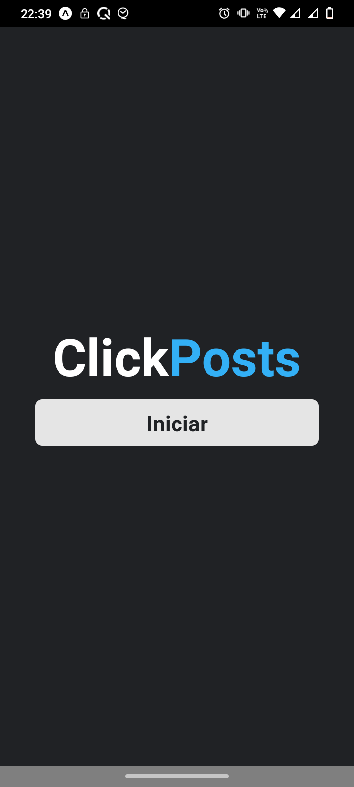
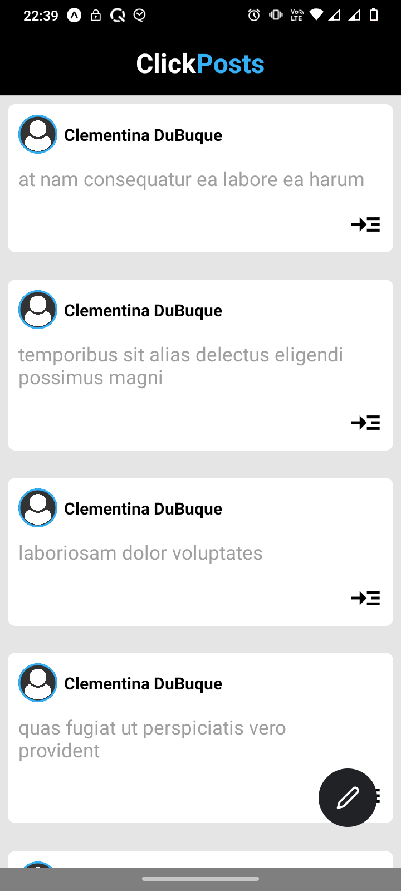
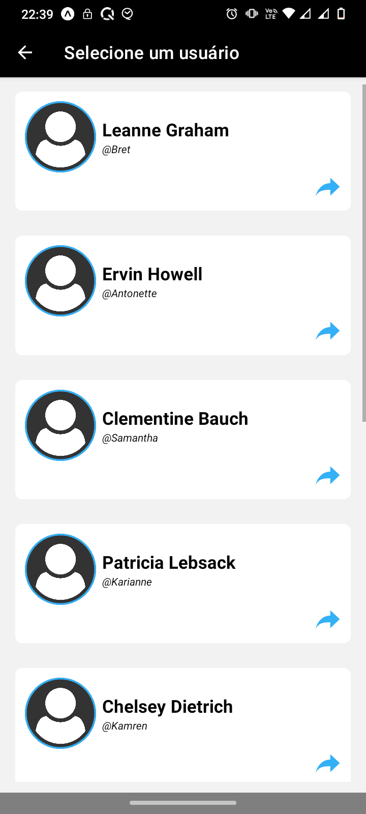
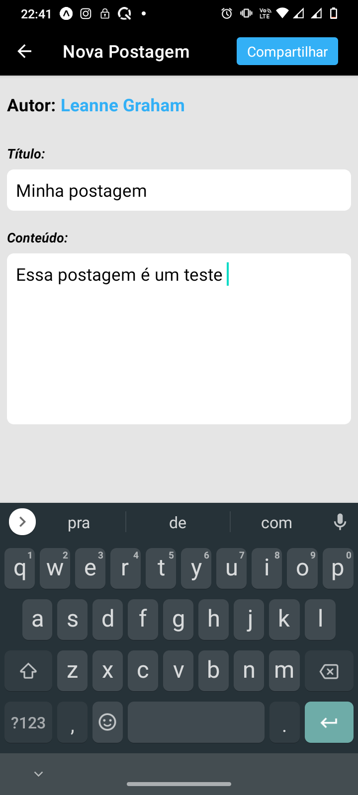

# ClickPost


Desafio realizado durante seleção de estagiário em React Native, na Clicksoft. O aplicativo consume uma api REST (jsonplaceholder) onde lista, cadastra, edita e apaga postagens, também é realizado o armazenamento no AsyncStorage.

## Screenshots

<p align="center">
    
    
</p>

<p align="center">
    
    
</p>

## Tecnologias
- React Native 
- TypeScript
- Expo
- Axios
- Async-storage
- react-native-vector-icons
- react-native-animatable
- styled-components
- ...
___

## :hammer: Funcionalidades do App

- `Cadastrar Posts`
- `Excluir Posts`
- `Listar Posts`
- `Listar usuários`
- `Requisições para a API (Get, PUT e DELETE)`

___

## Instalação

Clone o projeto e acesse a sua pasta: 

```sh
$ git clone https://github.com/thiagoemanoel98/ClickPost.git
$ cd ClickPost
```

Instale as dependências do projeto e inicie:

```sh
# Dependências
$ expo install 

# Start App
$ expo start

```
___

Made with :coffee: by Thiago Emanoel :v:
